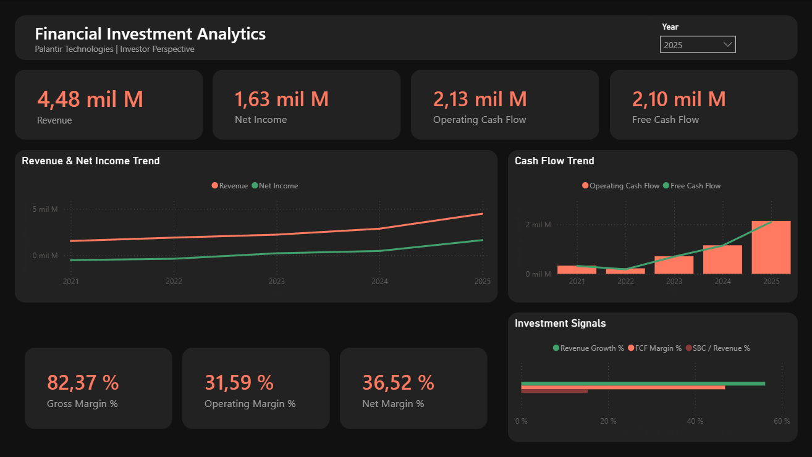
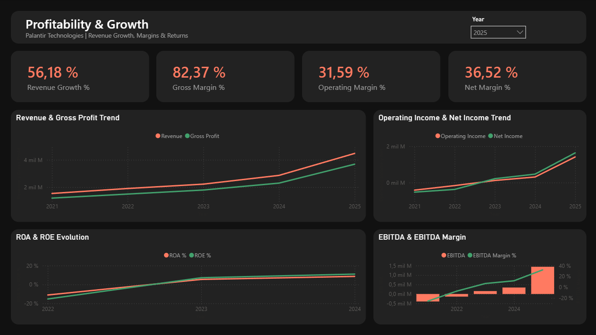
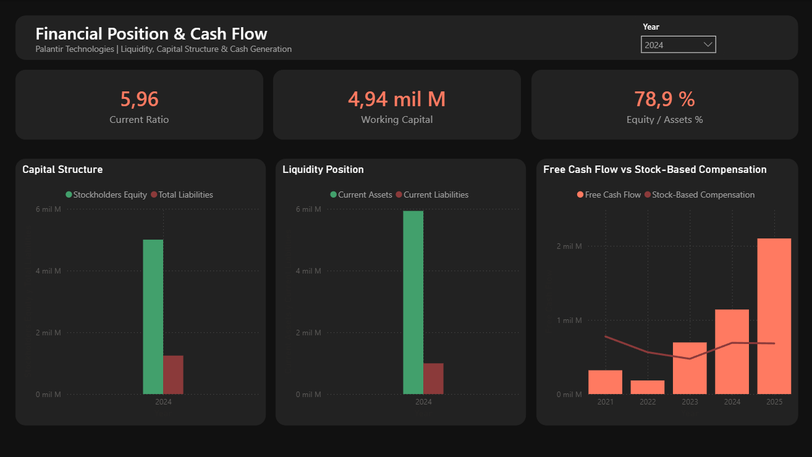
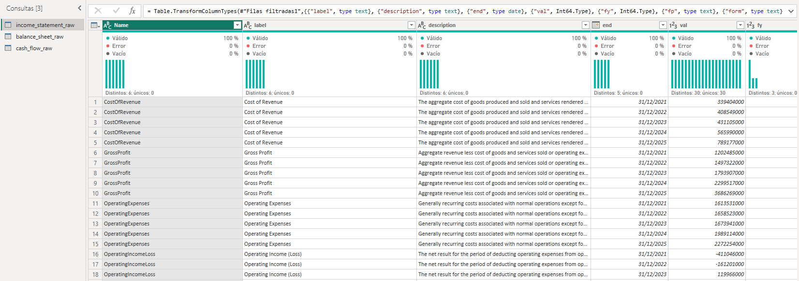
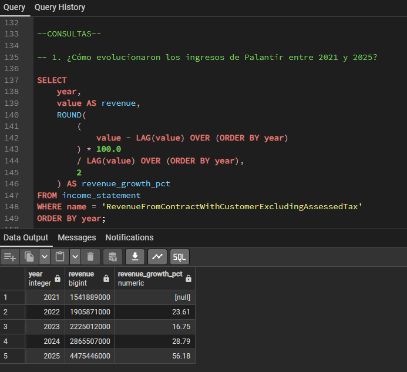
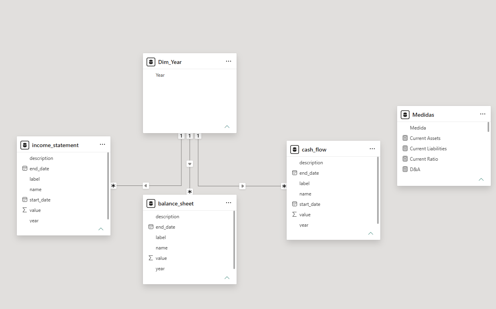
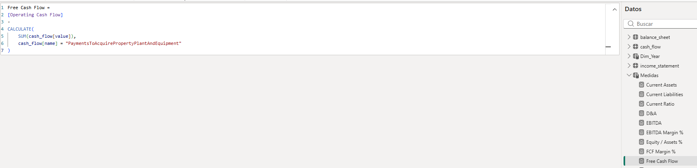

<h1 align="center">Financial Investment Analytics | Palantir Technologies</h1>

<p align="center">
  <b>Santiago Vázquez</b><br>
  Proyecto de análisis financiero desarrollado con datos reales de <b>Palantir Technologies (PLTR)</b> publicados en SEC EDGAR, analizando su evolución reciente en crecimiento, rentabilidad, generación de caja, liquidez y estructura patrimonial desde una perspectiva de inversión.
</p>

<p align="center">
  
  
  
  
  
</p>

---

## 📌 Resultados Principales

- **Revenue:** crecimiento de **USD 1,54B a USD 4,48B** entre 2021 y 2025.
- **Revenue Growth 2025:** **+56,18%** interanual.
- **Net Income 2025:** aproximadamente **USD 1,63B**.
- **Free Cash Flow 2025:** aproximadamente **USD 2,10B**.
- **Current Ratio 2024:** **5,96**.
- **Equity / Assets 2024:** **78,9%**.
- **Indicador a monitorear:** Stock-Based Compensation continúa siendo relevante, aunque su peso relativo frente al Free Cash Flow mejoró hacia el final del período.

---

## 📊 Dashboards

### 1. Overview

Vista general con los principales KPIs de crecimiento, rentabilidad, generación de caja, márgenes e Investment Signals.



---

### 2. Profitability & Growth

Análisis de crecimiento y rentabilidad mediante Revenue Growth, márgenes, Operating Income, Net Income, ROA, ROE y EBITDA.



---

### 3. Financial Position & Cash Flow

Análisis de liquidez, capital de trabajo, estructura patrimonial, Free Cash Flow y Stock-Based Compensation.



---

## 🎯 Objetivo del Análisis

El proyecto busca responder una pregunta principal:

**¿Cómo evolucionó la situación financiera de Palantir y qué señales pueden resultar relevantes para un potencial inversor?**

El análisis se concentra en:

- crecimiento de ingresos;
- rentabilidad y márgenes;
- generación de flujo de efectivo;
- liquidez y capital de trabajo;
- ROA y ROE;
- estructura patrimonial;
- Stock-Based Compensation.

> El proyecto analiza la calidad financiera del negocio. No incluye una valuación de la acción ni constituye una recomendación de compra o venta.

---

## 🔄 Flujo de Datos

`SEC EDGAR (XBRL)` ➔ `Power Query` ➔ `PostgreSQL` ➔ `SQL` ➔ `Power BI + DAX`

1. **Fuente de datos:** información financiera oficial de Palantir obtenida desde SEC EDGAR mediante XBRL.
2. **Power Query:** transformación, limpieza y separación de la información en Income Statement, Balance Sheet y Cash Flow.
3. **PostgreSQL:** carga y organización de los datos para realizar consultas y análisis con SQL.
4. **Power BI:** conexión de las tablas financieras, creación de `Dim_Year`, medidas DAX y desarrollo del dashboard.


### Transformación en Power Query

El archivo JSON obtenido desde SEC EDGAR fue convertido a formato tabular, filtrando los conceptos contables y períodos necesarios para el análisis.



### Análisis con SQL

Se desarrollaron consultas para analizar:

1. Revenue y crecimiento interanual.
2. Gross Profit, Operating Income y Net Income.
3. Net Income vs Operating Cash Flow.
4. Operating Cash Flow vs CapEx.
5. Evolución de la situación financiera.
6. Stock-Based Compensation.



Las consultas completas se encuentran disponibles en la carpeta `sql/`.

### Modelo de Datos en Power BI

Income Statement, Balance Sheet y Cash Flow fueron relacionadas mediante una dimensión común de años (`Dim_Year`).



### Medidas DAX

A partir del modelo de datos se desarrollaron medidas DAX para construir los principales indicadores financieros utilizados en los dashboards.

Entre las métricas calculadas se incluyen:

- Revenue y Revenue Growth %
- Gross, Operating y Net Margin
- Operating Cash Flow y Free Cash Flow
- ROA y ROE
- EBITDA y EBITDA Margin
- Current Ratio y Working Capital
- Equity / Assets
- Stock-Based Compensation y SBC / Revenue

Las medidas fueron diseñadas para responder dinámicamente al año seleccionado y permitir el análisis histórico de la compañía.



---

## 💡 Principales Insights Financieros

### 1. Crecimiento acelerado

Revenue aumentó de aproximadamente **USD 1,54B en 2021 a USD 4,48B en 2025**.

El crecimiento se aceleró hacia el final del período y alcanzó **56,18% interanual en 2025**, el mayor crecimiento registrado entre los años analizados.

### 2. Transición hacia la rentabilidad

Palantir registraba pérdidas operativas y netas en 2021 y 2022, pero pasó a resultados positivos desde 2023.

En 2025 alcanzó aproximadamente:

- **Operating Income:** USD 1,41B.
- **Net Income:** USD 1,63B.
- **Operating Margin:** 31,59%.
- **Net Margin:** 36,52%.

El crecimiento de los ingresos comenzó a traducirse en una mejora significativa de los resultados.

### 3. Márgenes elevados y en expansión

Gross Margin se mantuvo por encima del 78% durante todo el período y alcanzó aproximadamente **82,37% en 2025**.

Operating Margin y Net Margin también mostraron una fuerte mejora, reflejando una mayor capacidad para convertir el crecimiento de ingresos en beneficios.

### 4. Fuerte generación de caja

Operating Cash Flow alcanzó aproximadamente **USD 2,13B en 2025**, mientras que Free Cash Flow llegó a **USD 2,10B**.

La pequeña diferencia entre ambas métricas se explica por un nivel de CapEx relativamente bajo, permitiendo que gran parte del efectivo generado por las operaciones quede disponible como Free Cash Flow.

### 5. Mejora de ROA y ROE

ROA y ROE pasaron de valores negativos a positivos durante el período analizado.

En 2024 alcanzaron aproximadamente:

- **ROA:** 8,6%.
- **ROE:** 11,0%.

Esto refleja una mejora en la capacidad de Palantir para generar resultados utilizando sus activos y el patrimonio de los accionistas.

### 6. Posición financiera sólida

En 2024 Palantir presentó:

- **Current Ratio:** 5,96.
- **Working Capital:** aproximadamente USD 4,94B.
- **Equity / Assets:** 78,9%.

Los activos corrientes superan ampliamente a los pasivos corrientes y el patrimonio tiene un peso elevado dentro de la estructura financiera.

### 7. Stock-Based Compensation como indicador a monitorear

Stock-Based Compensation continúa siendo relevante por su posible efecto de dilución sobre los accionistas.

Sin embargo, hacia el final del período la generación de caja creció a un ritmo considerablemente mayor:

- **Free Cash Flow 2025:** USD 2,10B.
- **Stock-Based Compensation 2025:** USD 0,68B.

Esto muestra una mejora en la relación entre generación de caja y compensación basada en acciones respecto de los primeros años analizados.

---

## 🛠️ Metodología y Limitaciones

- **Income Statement y Cash Flow:** período 2021–2025.
- **Balance Sheet:** período 2021–2024.
- **ROA y ROE:** período 2022–2024, utilizando activos y patrimonio promedio.
- **EBITDA:** calculado como Operating Income + Depreciation & Amortization.
- **Free Cash Flow:** calculado como Operating Cash Flow - CapEx.
- EBITDA y FCF pueden diferir de las métricas ajustadas publicadas por Palantir.
- Total Liabilities se interpreta como Pasivo Total y no como deuda financiera.

### Fórmulas principales

**EBITDA**

`EBITDA = Operating Income + Depreciation & Amortization`

**Free Cash Flow**

`Free Cash Flow = Operating Cash Flow - CapEx`

---

## ✅ Conclusión

Durante el período analizado, Palantir mostró una combinación de **fuerte crecimiento, mejora de rentabilidad, alta generación de caja y una posición financiera sólida**.

El Stock-Based Compensation continúa siendo un indicador relevante a monitorear. El análisis se concentra en la **calidad financiera del negocio**, sin incorporar una valuación de la acción.

---

## 📂 Estructura del Repositorio

```text
Financial-Investment-Analytics-Palantir/
├── data/
│   ├── raw/           # Datos originales obtenidos desde SEC EDGAR
│   └── clean/         # CSV procesados para el análisis
├── sql/               # Creación de tablas y consultas SQL
├── powerbi/           # Archivo final de Power BI (.pbix)
├── screenshots/       # Capturas utilizadas en la documentación
└── README.md
