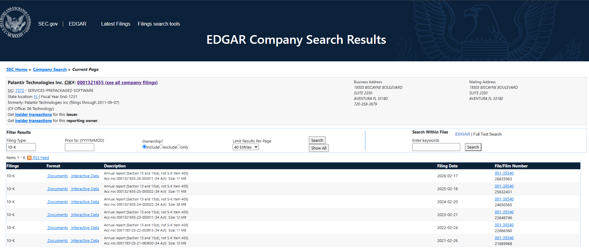
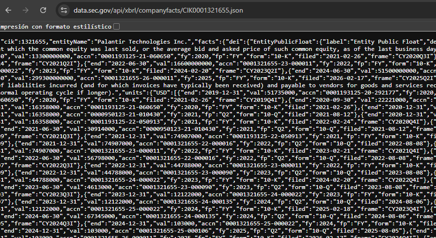
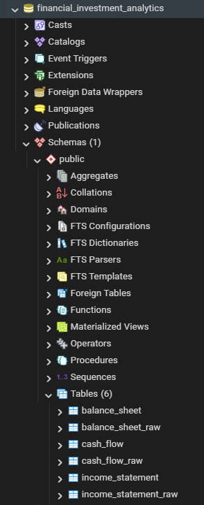

# Financial Investment Analytics - Palantir Technologies

Análisis financiero de Palantir Technologies desarrollado a partir de información real publicada en SEC EDGAR.

El objetivo del proyecto fue combinar conocimientos contables y financieros con herramientas de Data Analytics para analizar la evolución de la compañía desde una perspectiva de inversión.

Se trabajó principalmente sobre crecimiento, rentabilidad, generación de caja, liquidez, estructura patrimonial y algunos indicadores relevantes para el accionista.

**Herramientas:** SEC EDGAR · XBRL · Power Query · PostgreSQL · SQL · Power BI · DAX


---

## Objetivo del Proyecto

El objetivo principal fue responder una pregunta general:

**¿Cómo evolucionó la situación financiera de Palantir y qué señales pueden resultar relevantes para un potencial inversor?**

Para eso se analizaron:

- Crecimiento de ingresos.
- Evolución de la rentabilidad.
- Márgenes financieros.
- Generación de flujo de efectivo.
- Liquidez y capital de trabajo.
- Activos, pasivos y patrimonio.
- ROA y ROE.
- EBITDA.
- Stock-Based Compensation como posible riesgo de dilución.

El proyecto no busca determinar si la acción está cara o barata ni emitir una recomendación de compra o venta. El foco está puesto en analizar la situación financiera del negocio.

---

## Fuente de Datos

Los datos fueron obtenidos desde **SEC EDGAR**, la base oficial de información financiera y regulatoria de la U.S. Securities and Exchange Commission.

Para Palantir Technologies se identificó el **CIK 0001321655** y se utilizaron principalmente sus reportes anuales **Form 10-K**.

En lugar de copiar manualmente la información desde los estados financieros en PDF, se utilizó la información estructurada disponible en formato **XBRL**.



---

## Extracción de Datos XBRL

Para obtener los datos financieros se utilizó la **SEC XBRL Company Facts API** correspondiente a Palantir Technologies.

Esta fuente contiene los conceptos contables reportados por la compañía junto con sus valores, fechas y períodos correspondientes.

A partir de esta información se seleccionaron los datos necesarios para construir tres grupos principales:

- Income Statement.
- Balance Sheet.
- Cash Flow Statement.

El archivo original descargado desde SEC EDGAR fue conservado dentro de:

`data/raw/palantir_companyfacts_raw.json`



---

## Transformación de Datos con Power Query

El archivo JSON original fue cargado en **Power Query** para ordenar y preparar la información antes de llevarla a PostgreSQL.

Durante esta etapa se realizaron tareas como:

- Conversión de la información XBRL a formato tabular.
- Selección de valores expresados en USD.
- Filtrado de reportes anuales `10-K`.
- Selección de los conceptos contables necesarios.
- Revisión de fechas.
- Corrección de tipos de datos.
- Eliminación de información que no era necesaria para el análisis.
- Separación de los datos en Income Statement, Balance Sheet y Cash Flow.

Una decisión importante fue utilizar la fecha de cierre (`end_date`) para identificar correctamente el año al que corresponde cada dato.


Los archivos limpios fueron exportados como CSV:

- `income_statement_clean.csv`
- `balance_sheet_clean.csv`
- `cash_flow_clean.csv`

y se encuentran dentro de la carpeta `data/clean/`.

---

## Carga y Preparación en PostgreSQL

Una vez preparados los datos, los archivos CSV fueron cargados en una base PostgreSQL llamada:

`financial_investment_analytics`

Se crearon inicialmente tres tablas con la información importada:

- `income_statement_raw`
- `balance_sheet_raw`
- `cash_flow_raw`

Luego se generaron tablas más simples para utilizar en los análisis:

- `income_statement`
- `balance_sheet`
- `cash_flow`

En estas tablas se utilizó el año obtenido a partir de `end_date`, ya que el campo fiscal informado por SEC no siempre representaba directamente el período económico que se quería analizar.



---

## Análisis con SQL

Sobre las tablas de PostgreSQL se realizaron consultas SQL para responder seis preguntas principales:

1. ¿Cómo evolucionaron los ingresos de Palantir entre 2021 y 2025?
2. ¿Cómo evolucionaron Gross Profit, Operating Income y Net Income?
3. ¿La mejora del resultado contable también se refleja en generación de caja?
4. ¿Cómo evolucionaron Operating Cash Flow y CapEx?
5. ¿Cómo evolucionó la solidez financiera de Palantir?
6. ¿Cómo evolucionó el Stock-Based Compensation?

Estas consultas permitieron analizar la evolución del negocio antes de comenzar a construir el dashboard.


---

## Principales Resultados del Análisis SQL

A partir del análisis realizado con SQL se obtuvieron algunos resultados importantes:

- **Revenue:** aumentó de aproximadamente **USD 1,54B en 2021 a USD 4,48B en 2025**. En 2025 el crecimiento interanual fue de **56,18%**, el mayor del período analizado.

- **Rentabilidad:** Palantir registraba pérdidas operativas y netas en 2021 y 2022, pero pasó a resultados positivos a partir de 2023. En 2025 alcanzó aproximadamente **USD 1,41B de Operating Income** y **USD 1,63B de Net Income**.

- **Generación de caja:** el Operating Cash Flow fue positivo incluso durante los años en los que la compañía todavía registraba pérdidas contables. En 2025 llegó a aproximadamente **USD 2,13B**.

- **Free Cash Flow:** alcanzó aproximadamente **USD 2,10B en 2025**. La diferencia entre Operating Cash Flow y Free Cash Flow es relativamente baja debido al bajo nivel de CapEx.

- **Situación financiera:** los activos y el patrimonio crecieron con fuerza durante el período analizado, mientras que los pasivos mantuvieron un peso mucho menor.

- **Stock-Based Compensation:** disminuyó entre 2021 y 2023, pero volvió a aumentar posteriormente. Continúa siendo un indicador importante a monitorear debido a su posible impacto sobre la dilución de los accionistas.

---

## Modelo de Datos en Power BI

Las tablas finales de PostgreSQL fueron conectadas a **Power BI**.

Para organizar el modelo se creó una tabla `Dim_Year`, que contiene los años utilizados en el análisis.

Esta tabla se relaciona con:

- `income_statement`
- `balance_sheet`
- `cash_flow`

De esta manera, las tres tablas pueden ser analizadas utilizando un mismo filtro de año sin necesidad de relacionarlas directamente entre sí.


---

## Métricas Financieras con DAX

Dentro de Power BI se creó una tabla dedicada a medidas DAX.

Entre las principales métricas utilizadas se encuentran:

- Revenue
- Gross Profit
- Operating Income
- Net Income
- Operating Cash Flow
- Free Cash Flow
- Revenue Growth %
- Gross Margin %
- Operating Margin %
- Net Margin %
- ROA %
- ROE %
- EBITDA
- EBITDA Margin %
- Current Ratio
- Working Capital
- Equity / Assets %
- Stock-Based Compensation
- SBC / Revenue %

Estas medidas fueron utilizadas para construir los KPIs y gráficos de las distintas páginas del dashboard.

Un ejemplo es el cálculo de Free Cash Flow:

**Free Cash Flow = Operating Cash Flow - CapEx**


---

# Dashboard en Power BI

El dashboard fue dividido en tres páginas para analizar distintos aspectos de la compañía.

---

## Página 1 - Overview

La página **Overview** funciona como resumen general del análisis financiero.

Incluye los principales KPIs:

- Revenue.
- Net Income.
- Operating Cash Flow.
- Free Cash Flow.

También muestra:

- Revenue & Net Income Trend.
- Cash Flow Trend.
- Gross Margin %.
- Operating Margin %.
- Net Margin %.
- Revenue Growth %.
- FCF Margin %.
- SBC / Revenue %.

El objetivo de esta página es obtener una lectura rápida de crecimiento, rentabilidad, generación de caja y posibles señales relevantes para un inversor.


---

## Página 2 - Profitability & Growth

La segunda página se concentra en analizar si el crecimiento de Palantir también se traduce en una mejora de la rentabilidad.

Incluye:

- Revenue Growth %.
- Gross Margin %.
- Operating Margin %.
- Net Margin %.
- Revenue & Gross Profit Trend.
- Operating Income & Net Income Trend.
- ROA & ROE Evolution.
- EBITDA & EBITDA Margin.


Esta página permite observar claramente el cambio de Palantir desde una compañía que registraba pérdidas en 2021 y 2022 hacia una empresa con resultados positivos y márgenes crecientes.

---

## Página 3 - Financial Position & Cash Flow

La tercera página analiza principalmente liquidez, estructura financiera y generación de fondos.

Incluye:

- Current Ratio.
- Working Capital.
- Equity / Assets %.
- Capital Structure.
- Liquidity Position.
- Free Cash Flow vs Stock-Based Compensation.


En 2024, por ejemplo, Palantir presenta:

- **Current Ratio:** 5,96.
- **Working Capital:** aproximadamente USD 4,94B.
- **Equity / Assets:** 78,9%.

Esto muestra una posición de liquidez muy sólida y un peso importante del patrimonio dentro de la estructura financiera.

---

## Principales Insights

Luego de analizar los tres estados financieros y los indicadores construidos, los principales hallazgos fueron:

### 1. Fuerte crecimiento de ingresos

Los ingresos aumentaron de aproximadamente **USD 1,54B en 2021 a USD 4,48B en 2025**.

Además, el crecimiento se aceleró hacia el final del período y alcanzó **56,18% interanual en 2025**.

### 2. Mejora significativa de la rentabilidad

Palantir pasó de registrar pérdidas operativas y netas en 2021-2022 a obtener resultados positivos desde 2023.

En 2025:

- Operating Income: aproximadamente **USD 1,41B**.
- Net Income: aproximadamente **USD 1,63B**.

### 3. Expansión de márgenes

El Gross Margin se mantuvo elevado durante todo el período y llegó aproximadamente a **82,37% en 2025**.

Al mismo tiempo, Operating Margin y Net Margin mejoraron de forma importante.

### 4. Alta generación de caja

Operating Cash Flow alcanzó aproximadamente **USD 2,13B en 2025**.

Free Cash Flow llegó a aproximadamente **USD 2,10B**.

La pequeña diferencia entre ambas métricas refleja un nivel relativamente bajo de inversión en activos físicos.

### 5. Mejora de ROA y ROE

ROA y ROE pasaron de valores negativos a positivos entre 2022 y 2024.

Esto refleja una mejora en la capacidad de la compañía para generar resultados utilizando sus activos y el patrimonio de los accionistas.

### 6. Posición financiera sólida

En 2024:

- Current Ratio: **5,96**.
- Working Capital: aproximadamente **USD 4,94B**.
- Equity / Assets: **78,9%**.

Los activos corrientes superan ampliamente a los pasivos corrientes y el patrimonio tiene un peso importante dentro de la estructura financiera.

### 7. Stock-Based Compensation continúa siendo relevante

El Stock-Based Compensation sigue siendo un punto importante a monitorear.

Sin embargo, hacia el final del período el Free Cash Flow creció mucho más rápido que esta compensación.

En 2025:

- Free Cash Flow: aproximadamente **USD 2,10B**.
- Stock-Based Compensation: aproximadamente **USD 0,68B**.

Esto mejora la relación entre generación de caja y el posible riesgo de dilución.

---

## Metodología y Limitaciones

Durante el proyecto se tomaron algunas decisiones para mantener el análisis consistente con los datos disponibles.

- Los datos provienen de información financiera oficial publicada en SEC EDGAR.
- Para identificar correctamente el año de cada dato se utilizó principalmente `end_date`.
- Income Statement y Cash Flow incluyen información entre **2021 y 2025**.
- Balance Sheet se utilizó entre **2021 y 2024**, de acuerdo con los conceptos seleccionados durante la extracción.
- ROA y ROE se muestran únicamente entre **2022 y 2024**, ya que fueron calculados utilizando activos y patrimonio promedio y se necesita información del año anterior.
- EBITDA fue calculado como **Operating Income + Depreciation & Amortization**.
- Este EBITDA no corresponde al Adjusted EBITDA informado por Palantir.
- Free Cash Flow fue calculado como **Operating Cash Flow - CapEx**.
- Por este motivo también puede diferir del Adjusted Free Cash Flow publicado por la compañía.
- Total Liabilities se interpreta como Pasivo Total y no como deuda financiera.

---

## Conclusión

El proyecto permitió aplicar conocimientos contables y financieros dentro de un flujo completo de Data Analytics, utilizando información real de una empresa que cotiza en bolsa.

A partir de los estados financieros de Palantir se pudo analizar cómo evolucionaron sus ingresos, resultados, márgenes, generación de caja, liquidez y estructura patrimonial.

Durante el período analizado, Palantir mostró:

- fuerte crecimiento de ingresos;
- mejora significativa de rentabilidad;
- expansión de márgenes;
- creciente generación de Free Cash Flow;
- alta liquidez;
- una estructura patrimonial sólida.

El Stock-Based Compensation continúa siendo un indicador a monitorear desde la perspectiva del accionista.

El análisis se concentra en la situación financiera de la empresa y **no incluye una valuación de la acción ni una recomendación de compra o venta**.

---

## Estructura del Repositorio

```text
Financial-Investment-Analytics-Palantir/
│
├── data/
│   ├── raw/
│   └── clean/
│
├── sql/
│
├── powerbi/
│
├── screenshots/
│
└── README.md
